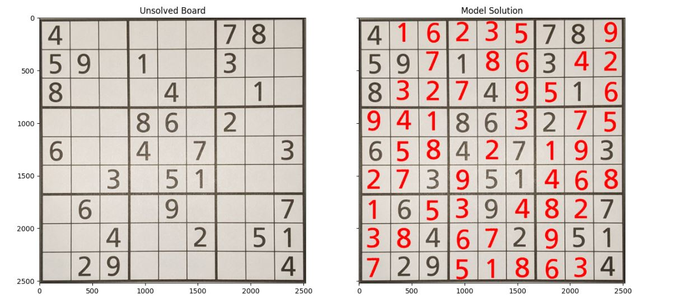

# SUDOKU VISION SOLVER AI
This repository contains all the essential components for a project that aims to identify and solve unsolved sudoku puzzles from the "BlockBuster Book of Sudoku" using Computer Vision to identify the Sudoku board and Deep Learning identify the digits and solve the puzzles.

## Original Image

## Puzzle Solved by CNN

## Project Overview
This project encompasses several stages:

1. Utilizing OpenCV and other Computer Vision techniques to identify the Sudoku board from a given image.
2. Employing a VGG16 architecture-based digit classifier to convert the Sudoku board image into a numpy array.
3. Using a Convolutional Neural Network (CNN) trained on over a million Sudoku puzzles combined with some post-processing logic to solve the identified puzzle.
4. Return image of puzzle with solution squares filled in red.
All the necessary code can be found in the sudokusolver python library, which exists as a sub-directory within this repository.

The results entire workflow can be fully observed in the sudoku_solver_demo.ipynb notebook.

## Files in the Repository
* sudoku_solver_demo.ipynb: A Jupyter notebook that walks through the entire project from image capture to solution.
* sudokusolver: A python library containing all the essential functions and classes required for this project.
* sudoku_solver_models: contain the model used to solve the sudoku
* digit_classifier_model: contains models used for digit classification
* images.7z: compressed version of all images used for model training
* sudoku_puzzles: contains million puzzles CNN was trained to solve

## Technology Used
* Python
* Numpy
* Matplotlib
* TensorFlow
* OpenCV

## Methods Used
* Computer Vision (OpenCV)
* VGG16 architecture for digit classification
* Convolutional Neural Network (CNN) for puzzle-solving

## Project Takeaways
The implemented approach using CNN managed to successfully solve 70% of the 50 puzzles captured from the "BlockBuster Book of Sudoku". This outcome is an indication of the efficiency of neural networks in complex pattern recognition and problem-solving.

Beyond the technical goals, this project served as a significant learning experience, enriching my proficiency in Deep Learning, Computer Vision, and general Software Development practices. It offered an opportunity to dive deep into complex image processing tasks, implement and fine-tune deep learning models, and architect software solutions that bridge various technologies and techniques.

## References
Towards Data Science Article: A detailed explanation of solving Sudoku using CNN.
Kaggle Notebook: The source of the model architecture used in this project.
